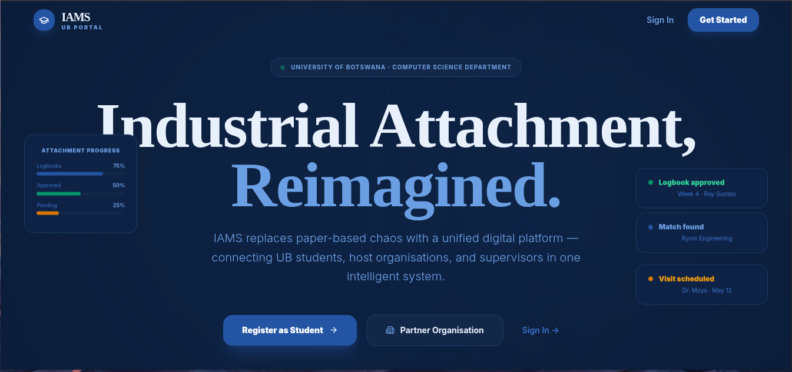
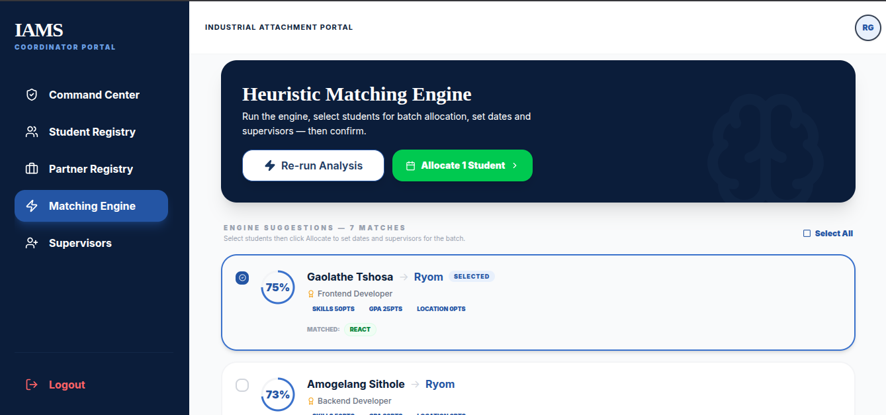
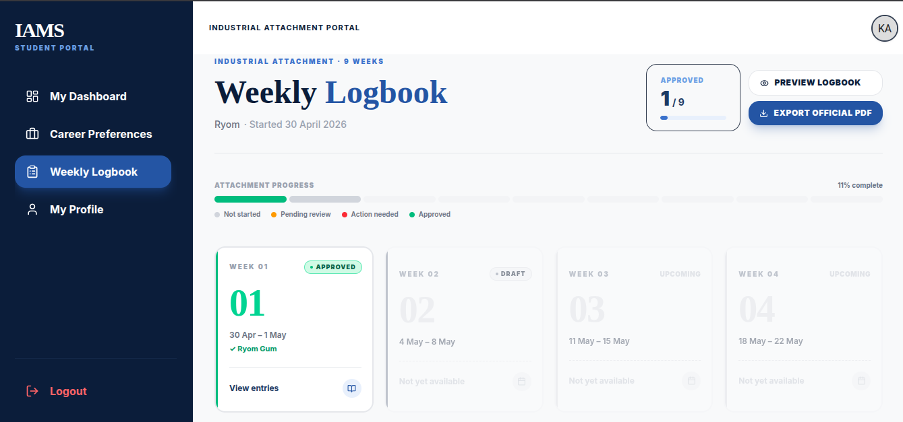
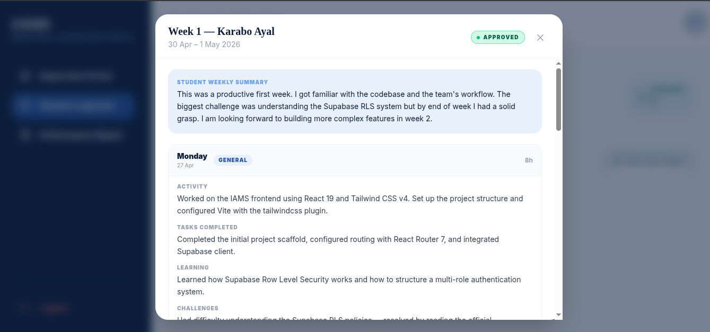
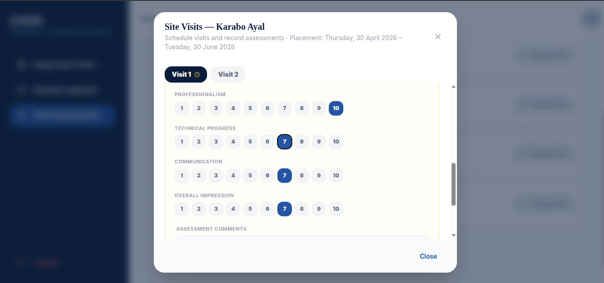
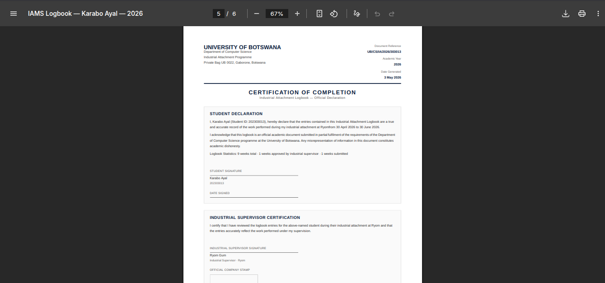

# Industrial Attachment Management System

Digitizing the industrial attachment lifecycle for the University of Botswana.

<br />

<div align="center">

[Live Demo](https://iams-nine.vercel.app) · [Test Docs](docs/TESTING.md) · [Report a Bug](https://github.com/Raymacmillan/Inustrial-Attachement-Management-System-IAMS-/issues)

<br />

</div>

---

## Table of Contents

- [Overview](#overview)
- [Screenshots](#screenshots)
- [Tech Stack](#tech-stack)
- [Architecture](#architecture)
- [Features](#features)
- [Project Structure](#project-structure)
- [Getting Started](#getting-started)
- [Environment Variables](#environment-variables)
- [Database](#database)
- [Edge Functions](#edge-functions)
- [Testing](#testing)
- [Deployment](#deployment)
- [Release History](#release-history)
- [Future Improvements](#future-improvements)
- [Acknowledgements](#acknowledgements)
- [Contributing](#contributing)

---

## Overview

The Department of Computer Science at the University of Botswana manages hundreds of student industrial attachments annually through a fragmented, paper-based workflow. Coordinators manually match students to organisations, supervisors chase handwritten logbooks, and students receive no real-time feedback on their placement status.

**IAMS** replaces this entirely. It is a full-stack web platform that handles the complete industrial attachment lifecycle — from student onboarding and organisation registration, through intelligent algorithmic matching and placement management, to weekly digital logbooks, supervisor assessments, and legally-formatted PDF report generation.

### What Makes IAMS Different

| Traditional System | IAMS |
|---|---|
| Paper logbooks, prone to loss | Digital weekly logbook with auto-save |
| Manual matching by coordinator | Heuristic scoring engine with slot-aware deduplication |
| No document enforcement | Allocation blocked if required documents are missing |
| Supervisor visits uncoordinated | Two-phase visit scheduling with student email notification |
| No audit trail | Every approval digitally stamped with supervisor name, title, and timestamp |
| Physical PDF reports | Legally-formatted document with UB letterhead and signature blocks |

---

## Screenshots

## Screenshots

### Landing Page


### Coordinator — Heuristic Matching Engine


### Student — Weekly Logbook


### Industrial Supervisor — Week Review


### University Supervisor — Visit Assessment


### Official Logbook PDF Export


---

## Tech Stack

### Frontend

| Technology | Version | Purpose |
|---|---|---|
| [React](https://react.dev) | 19.x | UI component framework |
| [Vite](https://vitejs.dev) | 7.x | Build tool and dev server |
| [React Router](https://reactrouter.com) | 7.x | Client-side routing with nested layouts |
| [Tailwind CSS](https://tailwindcss.com) | 4.x | Utility-first styling with custom design tokens |
| [@react-pdf/renderer](https://react-pdf.org) | latest | Legal-grade PDF generation in the browser |

### Backend

| Technology | Purpose |
|---|---|
| [Supabase](https://supabase.com) (PostgreSQL) | Primary database with Row Level Security |
| [Supabase Auth](https://supabase.com/auth) | JWT-based authentication and session management |
| [Supabase Edge Functions](https://supabase.com/edge-functions) | Deno serverless functions for email and scoring |
| [Supabase Storage](https://supabase.com/storage) | CV, transcript, and avatar file storage |
| [Resend](https://resend.com) | Transactional email delivery |

### Testing & Tooling

| Tool | Purpose |
|---|---|
| [Vitest](https://vitest.dev) | Unit and integration test runner |
| [React Testing Library](https://testing-library.com/react) | Component rendering and DOM assertions |
| [@testing-library/user-event](https://testing-library.com) | Realistic user interaction simulation |
| [ESLint](https://eslint.org) | Static code analysis |
| [Lucide React](https://lucide.dev) | Open-source SVG icon library |

---

## Architecture

```
┌────────────────────────────────────────────────────────────────┐
│                        Browser (React 19)                       │
│  ┌──────────┐  ┌──────────┐  ┌─────────────┐  ┌───────────┐ │
│  │ Student  │  │   Org    │  │ Coordinator │  │Supervisors│ │
│  │  Portal  │  │  Portal  │  │  Dashboard  │  │(Ind.+Uni.)│ │
│  └────┬─────┘  └────┬─────┘  └──────┬──────┘  └─────┬─────┘ │
│       └─────────────┴────────────────┴────────────────┘        │
│                  React Router 7 + AuthContext                   │
└──────────────────────────┬─────────────────────────────────────┘
                            │  supabase-js SDK
┌──────────────────────────▼─────────────────────────────────────┐
│                       Supabase Platform                         │
│  ┌─────────────┐  ┌──────────┐  ┌──────────────────────────┐ │
│  │ PostgreSQL  │  │ Supabase │  │     Edge Functions        │ │
│  │ + RLS       │  │   Auth   │  │   (Deno Runtime)          │ │
│  └──────┬──────┘  └──────────┘  │                           │ │
│         │                       │  match-engine              │ │
│  ┌──────▼──────┐  ┌──────────┐  │  send-supervisor-invite   │ │
│  │  Supabase   │  │ pg_cron  │  │  complete-sup-reg         │ │
│  │  Storage    │  │ (Monday  │  │  weekly-logbook-reminder  │ │
│  │ (CVs, Docs) │  │ 05:00UTC)│  │  send-visit-notification  │ │
│  └─────────────┘  └──────────┘  │  send-status-notif.       │ │
│                                  └──────────────────────────┘ │
└────────────────────────────────────────────────────────────────┘
```

**Key design decisions:**

- **Row Level Security everywhere** — no admin access from the frontend. Every query is scoped to the authenticated user's role via RLS policies and a `SECURITY DEFINER` function to bypass JWT caching.
- **Five distinct user roles** — `student`, `org`, `coordinator`, `industrial_supervisor`, `university_supervisor` — each with a dedicated portal and RLS-enforced data scope.
- **Edge functions for side effects** — email delivery, match scoring, and cron reminders all run in Deno at the edge, keeping the React client thin.
- **Invitation-based supervisor registration** — supervisors cannot self-register. A coordinator issues a tokenised email invitation which auto-links the account to the correct organisation on registration.

---

## Features

### Landing Page
- Animated scroll reveal sections with `IntersectionObserver`
- Problem statement, four-step flow, all five role breakdowns, feature grid
- Direct CTAs to student and organisation registration

### Student Portal

| Feature | Details |
|---|---|
| Registration | UB email (`@ub.ac.bw`) required, 9-digit student ID validated, full name (two words minimum) enforced |
| Document upload | CV and transcript to Supabase Storage — both required for matching eligibility |
| Career preferences | Technical skills, preferred locations, preferred roles, minimum stipend |
| Dashboard | Live placement card with org, position, dates, days remaining, both supervisors with contact links |
| Rejection flow | Red banner with coordinator email link and preferences CTA |
| Visit notifications | Scheduled supervisor visits with date-aware status (upcoming / today / passed / assessed) |
| Weekly Logbook | Mon–Fri tabbed daily entries, auto-save, progress bar, week grid |
| Supervisor feedback | Colour-coded comments — green on approval, red on flag |
| PDF export | Full legal document with UB letterhead, tables, digital stamp, certification page |

### Organisation Portal

| Feature | Details |
|---|---|
| Registration | Full org profile — industry, location, contact |
| Verification | Auto-verified when all required fields complete |
| Vacancies | Required skills, GPA minimum, available slots |
| Doc requirements | Toggle CV/transcript requirement per org — enforced at allocation |
| Supervisor roster | Multiple supervisors with role titles, invitation-based registration |

### Coordinator Dashboard

| Feature | Details |
|---|---|
| Student Registry | Full list with status filter, audit modal per student |
| Student Audit Modal | View docs, assign supervisors, set dates, update status, reject with two-step confirm |
| Rejection flow | Sets status, fires email notification, student sees banner immediately |
| Reinstatement | Return a rejected student to pending in one click |
| Supervisor Management | Invite supervisors by email with tokenised registration link |
| Matching Engine | Scored suggestions, slot-aware, doc-enforced, reject from engine |

### Matching Engine (Edge Function v8)

```
Total Score (max 100) = Skills + GPA + Location
```

| Criterion | Max | Formula |
|---|---|---|
| Skills match | 50 pts | `matched / required × 50` |
| GPA | 30 pts | `gpa / 5.0 × 30` — only if ≥ minimum |
| Location | 20 pts | Flat 20pts if location matches |

Slot-aware deduplication: each vacancy is offered to at most `available_slots` students. Highest scorers claim slots first. Displaced students redirect to next-best match.

### Industrial Supervisor Portal

| Feature | Details |
|---|---|
| Week review | Full daily log display, student reflection, previous comments visible |
| Approve | Digital stamp to `logbook_signatures` + `logbook_weeks` + optional comments |
| Flag | `status: action_needed` with feedback — student sees red banner, can resubmit |
| Performance report | End-of-attachment scoring — technical, initiative, teamwork, reliability, overall |

### University Supervisor Portal

| Feature | Details |
|---|---|
| Logbook monitoring | Read-only logbook view across all students |
| Visit scheduling | Step 1: schedule with date + notes → student email sent; Step 2: fill scores after visit |
| Date enforcement | Dates constrained to placement period, cannot be past |
| Confirm modal | Explicit confirmation before scheduling — email preview shown |
| Assessment lock | Score form disabled until visit date arrives |

### Automated Emails

| Trigger | Function | Recipient |
|---|---|---|
| Supervisor invited | `send-supervisor-invite` | Supervisor |
| Visit scheduled | `send-visit-notification` | Student |
| Student rejected | `send-student-status-notification` | Student |
| Monday morning | `weekly-logbook-reminder` | Students with unsubmitted logbook |

### Logbook PDF

Three-section legal document generated client-side:

1. **Cover** — UB letterhead, reference `UB/CS/IA/YEAR/STUDENTID`, student particulars, placement details, weekly summary table
2. **Week pages** — daily log table (Day / Date / Activities / Hours), reflection, supervisor feedback, digital stamp with seal
3. **Certification** — student declaration, industrial supervisor certification with company stamp box, university supervisor endorsement, formal signature lines

---

## Project Structure

```
IAMS/
├── src/
│   ├── components/
│   │   ├── layout/          # RootLayout, StudentLayout, DashboardLayout, ProtectedRoute
│   │   └── ui/              # Button, Input, Badge, StatusBadge, StatCard, TabBar,
│   │                        # Textarea, ConfirmModal, EmptyState, DigitalStamp
│   ├── constants/
│   │   └── matchingOptions.js
│   ├── context/
│   │   ├── AuthContext.jsx
│   │   └── AvatarContext.jsx
│   ├── features/
│   │   └── logbook/
│   │       ├── LogbookManager.jsx
│   │       └── components/
│   │           ├── LogbookModal.jsx
│   │           ├── LogbookPDF.jsx       # PDF export + preview + useLogbookWeeks hook
│   │           ├── WeekCard.jsx
│   │           └── DailyEntryRow.jsx
│   ├── lib/
│   │   └── supabaseClient.js
│   ├── routes/
│   │   ├── routes.jsx
│   │   ├── routes.test.jsx
│   │   └── routes.release2.test.jsx
│   ├── services/
│   │   ├── coordinatorService.js
│   │   ├── logbookService.js
│   │   ├── orgService.js
│   │   ├── studentService.js
│   │   └── supervisorService.js
│   ├── views/
│   │   ├── auth/            # Login, RegisterStudent, RegisterOrg, RegisterSupervisor,
│   │   │                    # ForgotPassword, UpdatePassword, Unauthorized, NotFound
│   │   ├── admin/           # CoordinatorDashboard, MatchEngine, PartnerRegistry,
│   │   │                    # StudentRegistry, StudentAuditModal, SupervisorManagement
│   │   ├── organization/    # Portal, OrgProfile, Requirements, OrgApplications
│   │   ├── student/         # Dashboard, Profile, Preferences
│   │   ├── supervisor/      # IndustrialSupervisorPortal, UniversitySupervisorPortal
│   │   └── LandingPage.jsx
│   ├── __tests__/
│   │   ├── registration.test.jsx
│   │   └── release2.acceptance.test.jsx
│   ├── services/__tests__/
│   │   ├── coordinatorService.test.js
│   │   ├── coordinatorService.release2.test.js
│   │   └── logbookService.test.js
│   ├── utils/__tests__/
│   │   └── validation.test.js
│   └── setupTests.js
├── supabase/
│   └── functions/
│       ├── match-engine/
│       ├── send-supervisor-invite/
│       ├── complete-supervisor-registration/
│       ├── weekly-logbook-reminder/
│       ├── send-visit-notification/
│       └── send-student-status-notification/
├── docs/
│   ├── TESTING.md
│   └── screenshots/
├── .env.example
├── vercel.json
└── vite.config.js
```

---

## Getting Started

### Prerequisites

| Requirement | Version |
|---|---|
| Node.js | ≥ 18.x |
| npm | ≥ 9.x |
| Supabase account | free tier sufficient |
| Resend account | for email notifications |

### Installation

```bash
# Clone the repository
git clone git@github.com:Raymacmillan/Inustrial-Attachement-Management-System-IAMS-.git
cd Inustrial-Attachement-Management-System-IAMS-

# Install dependencies
npm install

# Set up environment variables
cp .env.example .env
# Open .env and fill in your Supabase credentials

# Start the development server
npm run dev
```

The app runs at `http://localhost:5173`.

### Creating a Coordinator Account

Coordinators cannot self-register through the public form. The database trigger
`handle_new_user_role` runs automatically on every new user — if no role is
set in the metadata it defaults to `coordinator`, so creating a user directly
in the Supabase Dashboard is all you need.

**Step 1 — Create the auth account**

Go to **Supabase Dashboard → Authentication → Users → Add User → Create New User**, enter:
- Email: `coordinator@ub.ac.bw`
- Password: a strong password of your choice
- Check **Auto Confirm User** so the account is active immediately without an email link

The trigger fires on insert and writes `role = 'coordinator'` to `user_roles` automatically.

**Step 2 — Verify**

Log in at `/login` with the credentials from Step 1. You should land on the
Coordinator Dashboard immediately.

> **If login redirects to `/unauthorized`:** The trigger did not fire correctly.
> Run this in **SQL Editor** to fix it manually:
>
> ```sql
> INSERT INTO user_roles (user_id, role)
> SELECT id, 'coordinator'
> FROM auth.users
> WHERE email = 'coordinator@ub.ac.bw'
> ON CONFLICT (user_id) DO UPDATE SET role = 'coordinator';
> ```
>
> The `ON CONFLICT DO UPDATE` ensures it never duplicates — it either inserts
> or corrects an existing wrong role. Safe to run multiple times.
### Running Tests

```bash
# Full test suite (83 tests)
npm run test

# Watch mode
npm run test -- --watch

# Single file
npx vitest run src/services/__tests__/logbookService.test.js
```

---

## Environment Variables

```bash
cp .env.example .env
```

**`.env.example`**

```env
# ─── Supabase ─────────────────────────────────────────────────────────────────
# Supabase Dashboard → Settings → API

VITE_SUPABASE_URL=your_supabase_url
VITE_SUPABASE_ANON_KEY=your_anon_public_key_here
```

### Edge Function Secrets

Set in **Supabase Dashboard → Edge Functions → Secrets** — not in `.env`:

| Secret | Required | Description |
|---|---|---|
| `RESEND_API_KEY` | ✅ | API key from resend.com |
| `APP_URL` | ✅ | Deployed frontend URL — e.g. `https://iams-nine.vercel.app` |
| `FROM_EMAIL` | ✅ | Verified sender — e.g. `IAMS <noreply@yourdomain.com>` |
| `TEST_EMAIL_OVERRIDE` | Dev only | Routes all emails to this address during local testing |

> **Local development:** Resend's `onboarding@resend.dev` sender only delivers to the Resend account owner's email. Set `TEST_EMAIL_OVERRIDE` to your own email to receive all notifications during testing. Remove it in production.

---

## Database

### Setup

1. Create a Supabase project at [supabase.com](https://supabase.com)
2. Open **SQL Editor**
3. Paste `supabase/migrations/001_iams_schema.sql` and run

### Schema

```
auth.users (Supabase managed)
    │
    ├── user_roles                         student | org | coordinator
    │                                      industrial_supervisor | university_supervisor
    ├── student_profiles                   full_name, student_id, gpa, cv_url,
    │                                      transcript_url, status (enum)
    ├── student_preferences                skills[], roles[], locations[]
    ├── organization_profiles              org_name, industry, location,
    │                                      requires_cv, requires_transcript
    ├── organization_vacancies             role_title, required_skills[], min_gpa,
    │                                      available_slots, is_active
    ├── organization_supervisors           full_name, role_title, org_id, user_id
    ├── university_supervisors             full_name, email, department, user_id
    ├── supervisor_invitations             token, role, email, org_id, expires_at
    └── placements
        ├── logbook_weeks                  week_number, status, supervisor_comments,
        │   ├── daily_logs                 stamped_by_name/title, approved_at
        │   └── logbook_signatures         signed_by, signer_name, signed_at
        ├── visit_assessments              visit_number, visit_date, status,
        │                                  5 score columns, comments
        └── supervisor_reports             5 score columns, strengths,
                                           areas_for_improvement, recommend_for_employment
```

**`attachment_status` enum:** `pending | matched | allocated | completed | rejected`

### Key DB Objects

| Object | Type | Purpose |
|---|---|---|
| `is_coordinator()` | `SECURITY DEFINER` Function | RLS policy helper — avoids JWT caching on coordinator checks |
| `handle_new_user()` | Trigger | Creates profile row (`student_profiles` or `organization_profiles`) on signup |
| `handle_new_user_role()` | Trigger | Inserts into `user_roles` on signup |
| `decrement_vacancy_slots(id)` | RPC | Reduces `available_slots` by 1 after allocation, floor 0 |

### Weekly Logbook Reminder (pg_cron)

```sql
SELECT cron.schedule(
  'weekly-logbook-reminder',
  '0 5 * * 1',
  $$
    SELECT net.http_post(
      url := 'https://<PROJECT-REF>.supabase.co/functions/v1/weekly-logbook-reminder',
      headers := jsonb_build_object(
        'Content-Type', 'application/json',
        'Authorization', 'Bearer ' || current_setting('app.service_role_key', true)
      ),
      body := '{}'::jsonb
    );
  $$
);
```

---

## Edge Functions

| Function | Version | Trigger | Purpose |
|---|---|---|---|
| `match-engine` | v8 | Manual (coordinator) | Scores students vs vacancies, slot-aware deduplication |
| `send-supervisor-invite` | v4 | On invite creation | Tokenised registration email to supervisor |
| `complete-supervisor-registration` | v2 | On token submission | Creates account, links to roster |
| `weekly-logbook-reminder` | v1 | pg_cron Monday 05:00 UTC | Email students with unsubmitted logbooks |
| `send-visit-notification` | v2 | On visit schedule | Email student — date, supervisor, notes, CTA |
| `send-student-status-notification` | v1 | On rejection | Email student with status and next steps |

```bash
# Deploy all functions
supabase functions deploy match-engine
supabase functions deploy send-supervisor-invite
supabase functions deploy complete-supervisor-registration
supabase functions deploy weekly-logbook-reminder
supabase functions deploy send-visit-notification
supabase functions deploy send-student-status-notification
```

---

## Testing

83 tests across 8 files. Full documentation in [`docs/TESTING.md`](docs/TESTING.md).

| File | Type | Tests | Release | Covers |
|---|---|---|---|---|
| `src/utils/__tests__/validation.test.js` | Unit | 18 | R1 | `isValidStudentId`, `isPasswordStrong` |
| `src/services/__tests__/coordinatorService.test.js` | Unit | 9 | R1 | `updateStudentStatus` lifecycle |
| `src/services/__tests__/coordinatorService.release2.test.js` | Unit | 9 | R2 | `rejectStudent`, `reinstateStudent` |
| `src/services/__tests__/logbookService.test.js` | Unit | 6 | R2 | `submitWeek` guard, approved week protection |
| `src/routes/routes.test.jsx` | Integration | 13 | R1 | All R1 routes render correct component |
| `src/routes/routes.release2.test.jsx` | Integration | 9 | R2 | All R2 routes, supervisor portal guards |
| `src/__tests__/registration.test.jsx` | Acceptance | 12 | R1 | Student and org registration journeys |
| `src/__tests__/release2.acceptance.test.jsx` | Acceptance | 9 | R2 | Rejection banner, reject flow, supervisor token |

**Definition of Done (per Section 3.7 of Sprint Planning):**

- ✅ Unit, integration, and acceptance tests all passing
- ✅ 0 failing — `npm run test` passes clean
- ✅ Test files committed to `develop` alongside feature code

---

## Deployment

### Frontend — Vercel

1. Push `main` to GitHub
2. Import at [vercel.com/new](https://vercel.com/new)
3. Add env vars: `VITE_SUPABASE_URL`, `VITE_SUPABASE_ANON_KEY`
4. Build settings (auto-detected): Framework = **Vite**, Output = `dist`

`vercel.json` at project root (required for React Router):

```json
{
  "rewrites": [{ "source": "/(.*)", "destination": "/index.html" }]
}
```

### Backend — Supabase

After deploying, update **Authentication → URL Configuration**:

```
Site URL:      https://your-app.vercel.app
Redirect URLs: https://your-app.vercel.app/**
               http://localhost:5173/**
```

---

## Release History

| Version | Date | Deliverables |
|---|---|---|
| **1.0 (MVP)** | April 10, 2026 | Auth, registration, heuristic matching engine, coordinator dashboard |
| **2.0 (Final)** | May 4, 2026 | Weekly logbooks, supervisor portals, PDF export, rejection flow, visit scheduling, automated email, 83 tests |

---

## Future Improvements

### AI-Powered Document Validation

Currently any PDF can be uploaded as a CV or transcript — there is no check that the document is what it claims to be. A production extension would:

- Use a vision model (GPT-4o or a fine-tuned classifier) to verify that uploaded CVs contain expected sections (Contact, Experience, Education, Skills) and transcripts contain academic records, institution name, and student ID.
- Return a confidence score so coordinators can review borderline cases rather than applying a binary accept/reject.
- This makes the existing `has_all_docs` enforcement significantly more robust — currently it only checks for file presence.

### Business Licence Verification

Any person can register an organisation with any name. A production extension would:

- Require organisations to upload their certificate of incorporation or business registration number.
- Integrate with the Companies and Intellectual Property Authority (CIPA) of Botswana API to auto-verify registration numbers against the official register.
- Block student allocations to unverified organisations.

### Real-Time Notifications

Status changes (approval, flagging, visit scheduling) only surface when the student next loads the dashboard. A production extension would:

- Use Supabase Realtime subscriptions on `logbook_weeks.status` and `visit_assessments`.
- Show a notification badge in the nav and a toast popup when the week status changes.

### Analytics Dashboard

The coordinator currently sees summary stats only. A production extension would surface:

- Placement rate by industry, location, and department over time.
- Logbook completion rates and submission timeliness by week.
- Supervisor approval turnaround times.
- Exportable CSV/PDF reports for departmental review.

### Mobile Application

The interface is responsive but browser-only. A production extension would include:

- React Native / Expo app sharing the same Supabase backend.
- Push notifications for logbook reminders, supervisor feedback, and visit confirmations.
- Offline-capable logbook entry with sync when connectivity returns — important for students in areas with intermittent network access.

### Multi-University Support

The schema is extendable for multi-tenancy:

- Add a `universities` table and scope all data to `university_id`.
- Shared organisation pool — a company with vacancies could accept students from multiple universities simultaneously.

### Two-Factor Authentication

Coordinator and supervisor accounts have elevated write access and should be better protected:

- TOTP-based 2FA via Supabase Auth.
- Mandatory for coordinators, optional for supervisors.

### Student Self-Assessment

At attachment end, a student self-assessment form would:

- Use matching criteria to the industrial supervisor's performance report.
- Cross-reference student self-scores with supervisor scores to flag large discrepancies for coordinator review.

---

## Acknowledgements

### Open Source Libraries

| Library | Usage |
|---|---|
| [Lucide React](https://lucide.dev) | All icons throughout the UI — tabbed logbook, supervisor stamp, status badges, and navigation use Lucide exclusively. Chosen for its open-source licence, accessibility, and consistent visual language. |
| [React 19](https://react.dev) | Core UI framework. React 19's concurrent features and improved hooks power the auto-save logbook and real-time status updates. |
| [Vite 7](https://vitejs.dev) | Build tooling. HMR during development, optimised production bundles, and native ESM support. |
| [Tailwind CSS v4](https://tailwindcss.com) | The entire design system — brand tokens, spacing scale, dark surfaces — is built on Tailwind's utility classes. |
| [Supabase](https://supabase.com) | PostgreSQL with RLS, Auth, Storage, Edge Functions, and Realtime from a single SDK. |
| [@react-pdf/renderer](https://react-pdf.org) | The legal logbook document with UB letterhead, tables, and signature blocks is rendered entirely in the browser. |
| [Resend](https://resend.com) | All automated emails — supervisor invites, visit notifications, rejection alerts, logbook reminders. |
| [Vitest](https://vitest.dev) | Compatible with Vite's plugin system. `vi.hoisted()` was critical for mocking Supabase before module imports are resolved. |
| [React Testing Library](https://testing-library.com) | `findByRole("heading", { name: /.../ })` with accessible name matching enabled testing split headings without brittle text selectors. |
| [React Router 7](https://reactrouter.com) | Nested layout system with `Outlet` enabled the multi-panel coordinator and supervisor dashboards. |

### Design Inspiration

| Source | What We Took |
|---|---|
| [Linear](https://linear.app) | Dark editorial aesthetic, dense information display, status badge patterns |
| [Vercel Dashboard](https://vercel.com) | Monospace typography for technical values, deployment timeline UI |
| [Supabase Studio](https://app.supabase.com) | Tab-based navigation within a single page, empty state messaging |
| [Stripe Dashboard](https://dashboard.stripe.com) | Two-column detail views, "danger zone" pattern for destructive actions, inline confirmation |
| [GitHub](https://github.com) | README conventions, branch protection workflow, commit message format |

### Technical Documentation Referenced

| Resource | Applied To |
|---|---|
| [Supabase RLS Guide](https://supabase.com/docs/guides/auth/row-level-security) | Multi-role RLS design and the `SECURITY DEFINER` coordinator role workaround |
| [Supabase Edge Functions](https://supabase.com/docs/guides/functions) | CORS handling, secret management, non-fatal error response patterns |
| [Vitest Mocking — vi.hoisted()](https://vitest.dev/guide/mocking.html) | Solution to `ReferenceError: Cannot access before initialization` in service tests |
| [RTL Queries Guide](https://testing-library.com/docs/queries/about) | `findByRole("heading")` for split heading text — documented in `TESTING.md` |
| [@react-pdf/renderer API](https://react-pdf.org/components) | `StyleSheet.create()`, `<Page>`, `<PDFDownloadLink>`, fixed footer with `render` prop |
| [Resend API Reference](https://resend.com/docs/api-reference/emails/send-email) | Email payload structure, error response handling |
| [pg_cron Documentation](https://github.com/citusdata/pg_cron) | Cron expression for Monday 05:00 UTC logbook reminder |
| [Postgres ALTER TYPE](https://www.postgresql.org/docs/current/sql-altertype.html) | `ALTER TYPE attachment_status ADD VALUE 'rejected'` without recreating the enum |

---

## Contributing

This project follows a **feature-branch Git workflow**.

### Branch Strategy

```
main      ── production (merged at each release)
  └── develop ── integration branch
        └── feature/* ── individual features, cut from develop
```

### Naming Conventions

```bash
feature/match-engine-scoring
feature/logbook-pdf-export
fix/rls-coordinator-update
test/logbook-service-unit
docs/readme-update
```

### Commit Format

```
feat(logbook):  add PDF export with UB letterhead
fix(auth):      resolve RLS policy for coordinator status check
test(service):  add unit tests for submitWeek guard
docs(readme):   update testing section for Release 2
chore(deps):    add @react-pdf/renderer
```

### Pre-Merge Checklist

- [ ] `npm run test` — all 83 tests pass
- [ ] `npm run build` — no build errors
- [ ] `npm run lint` — no ESLint errors
- [ ] Peer reviewed by at least one team member
- [ ] `docs/TESTING.md` updated if new tests were added

---

<div align="center">

<br />

Built with React, Supabase, and too much coffee


</div>